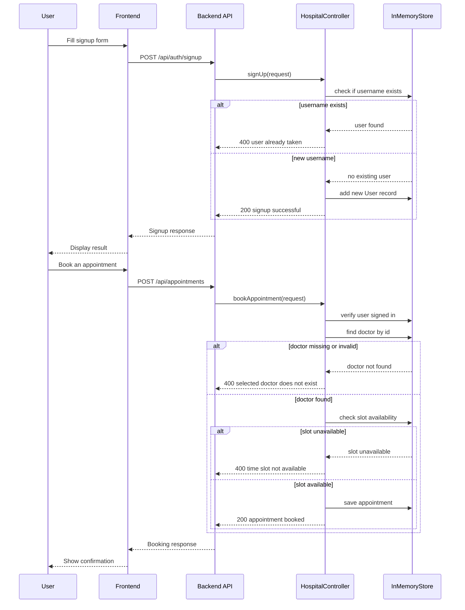

```mermaid
sequenceDiagram
    participant User
    participant Frontend
    participant API as Backend API
    participant HospitalController
    participant DataStore as InMemoryStore

    User->>Frontend: Fill signup form
    Frontend->>API: POST /api/auth/signup
    API->>HospitalController: signUp(request)
    HospitalController->>DataStore: check if username exists
    alt username exists
        DataStore-->>HospitalController: user found
        HospitalController-->>API: 400 user already taken
    else new username
        DataStore-->>HospitalController: no existing user
        HospitalController->>DataStore: add new User record
        HospitalController-->>API: 200 signup successful
    end
    API-->>Frontend: Signup response
    Frontend-->>User: Display result

    User->>Frontend: Book an appointment
    Frontend->>API: POST /api/appointments
    API->>HospitalController: bookAppointment(request)
    HospitalController->>DataStore: verify user signed in
    HospitalController->>DataStore: find doctor by id
    alt doctor missing or invalid
        DataStore-->>HospitalController: doctor not found
        HospitalController-->>API: 400 selected doctor does not exist
    else doctor found
        HospitalController->>DataStore: check slot availability
        alt slot unavailable
            DataStore-->>HospitalController: slot unavailable
            HospitalController-->>API: 400 time slot not available
        else slot available
            HospitalController->>DataStore: save appointment
            HospitalController-->>API: 200 appointment booked
        end
    end
    API-->>Frontend: Booking response
    Frontend-->>User: Show confirmation
```